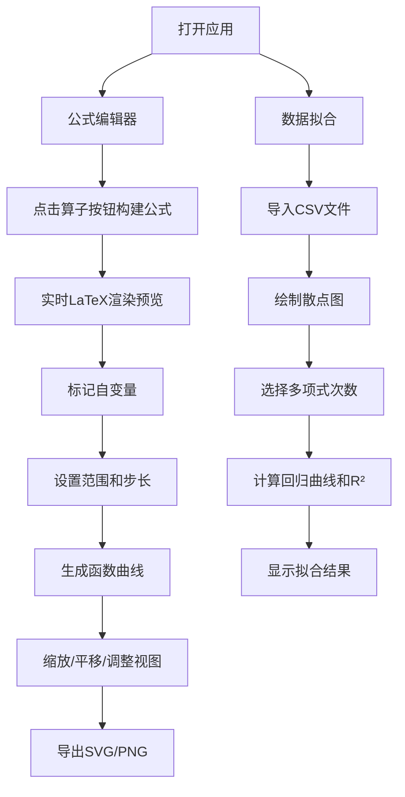

## 1. 产品概述

本产品是一个基于Web的"公式编辑器与函数绘图"复合工具，为学生、教师和科研人员提供直观的数学公式构建和可视化解决方案。用户无需记忆LaTeX语法，通过点击按钮即可构建复杂数学公式，并实时预览和生成函数图像。

- 主要用途：数学公式编辑、函数可视化、数据分析与拟合
- 目标用户：学生、教师、科研人员、数学爱好者
- 产品价值：降低数学公式编辑门槛，提供即时可视化反馈，支持数据导入与回归分析

## 2. 核心功能

### 2.1 功能模块

1. **公式编辑器**：可视化按钮构建数学公式，实时LaTeX渲染
2. **函数绘图**：根据公式生成函数曲线，支持多曲线、坐标系统切换
3. **数据拟合**：CSV导入、散点图绘制、多项式回归拟合
4. **存储管理**：本地保存与加载公式和绘图配置

### 2.3 页面详情

| 页面名称 | 模块名称 | 功能描述 |
|-----------|-------------|---------------------|
| 主应用页面 | 公式编辑器面板 | 算子按钮区、公式输入区、LaTeX预览区、变量标记功能 |
| 主应用页面 | 绘图控制面板 | 曲线管理（最多3条）、颜色/线型设置、坐标系切换、显示选项 |
| 主应用页面 | 画布区域 | 函数图像绘制、缩放平移、关键点标注、网格与坐标轴 |
| 主应用页面 | 数据拟合面板 | CSV文件导入、散点图显示、多项式次数选择、拟合结果展示 |
| 主应用页面 | 存储管理 | 保存配置到localStorage、加载已保存配置、配置列表管理 |

## 3. 核心流程

### 3.1 公式编辑与绘图流程
用户点击算子按钮构建公式 → 系统实时渲染LaTeX预览 → 用户标记自变量 → 设置变量范围和步长 → 点击绘图按钮 → 生成函数曲线 → 用户可调整视图（缩放/平移）→ 导出为SVG/PNG

### 3.2 数据拟合流程
用户导入CSV文件 → 系统解析数据并绘制散点图 → 用户选择多项式次数（1-5次）→ 系统计算回归曲线和R²值 → 显示拟合公式和评估指标

## 4. 用户界面设计

### 4.1 设计风格
- **设计理念**：现代科技感，深色主题，学术专业风格
- **主色调**：深蓝色系（#1e3a5f 作为主背景），搭配亮青色（#00d4ff）作为强调色
- **辅助色**：柔和的紫色（#a78bfa）、暖橙色（#fb923c）用于区分不同曲线
- **字体**：使用 'JetBrains Mono' 等宽字体用于公式显示，'Inter' 用于界面文字
- **按钮风格**：圆角设计，微妙的渐变效果，悬停时有发光效果
- **布局风格**：三栏式布局，左侧工具栏、中间画布、右侧控制面板
- **图标风格**：简洁的线性图标，统一的视觉语言

### 4.2 页面设计概览

| 页面名称 | 模块名称 | UI元素 |
|-----------|-------------|-------------|
| 主应用 | 顶部导航栏 | 应用标题、保存/加载按钮、导出按钮、主题切换 |
| 主应用 | 左侧公式面板 | 算子按钮分组（基础运算、高级运算、函数、符号）、公式显示区 |
| 主应用 | 中央画布区 | 函数图像画布、坐标系、网格线、曲线图例 |
| 主应用 | 右侧控制面板 | 曲线管理、坐标系统切换、显示选项、缩放控制 |
| 主应用 | 底部状态栏 | 当前公式、光标位置、提示信息 |

### 4.3 响应性
- 桌面端（默认）：三栏式布局，充分利用宽屏空间
- 平板端：左右面板可折叠，画布区域自适应
- 移动端：垂直堆叠布局，优先保证画布可视区域

### 4.4 交互体验
- 公式按钮点击时有微妙的缩放和发光反馈
- 画布缩放和平滑过渡动画
- 悬停在曲线上时显示数值提示
- 面板展开/收起时有平滑的过渡动画
