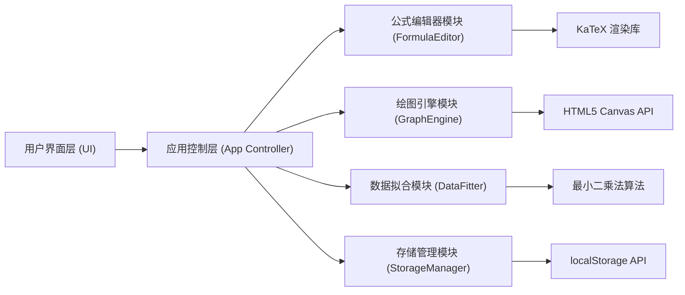

## 1. 架构设计

本项目为纯前端单页应用，采用模块化JavaScript架构，无需后端服务。



## 2. 技术描述

- **前端技术栈**：原生 HTML5 + CSS3 + JavaScript (ES6+)
- **公式渲染**：KaTeX (通过 CDN 引入，轻量级 LaTeX 渲染库)
- **绘图技术**：HTML5 Canvas 2D API
- **样式方案**：CSS 自定义属性 + BEM 命名规范
- **模块管理**：原生 ES6 Modules (type="module")
- **数据存储**：浏览器 localStorage API
- **导出功能**：Canvas toDataURL (PNG) + 原生 SVG 生成

## 3. 文件结构

```
项目根目录/
├── index.html              # 主页面入口
├── css/
│   └── style.css           # 全局样式
├── js/
│   ├── app.js              # 应用主控制器
│   ├── formula-editor.js   # 公式编辑器模块
│   ├── graph-engine.js     # 绘图引擎模块
│   ├── data-fitter.js      # 数据拟合模块
│   ├── storage-manager.js  # 存储管理模块
│   └── utils.js            # 工具函数
└── assets/
    └── icons/              # 图标资源
```

## 4. 核心模块设计

### 4.1 公式编辑器模块 (FormulaEditor)
- 维护公式的抽象语法树 (AST) 或 token 列表
- 支持的算子：加法、减法、乘法、除法、幂运算、平方根、分数、积分、求和、正弦、余弦、正切、对数、自然指数、绝对值、π、e等（超过10种）
- 将公式转换为 LaTeX 字符串用于渲染
- 将公式转换为可执行的 JavaScript 函数用于计算
- 光标位置管理和公式编辑操作

### 4.2 绘图引擎模块 (GraphEngine)
- 管理 Canvas 画布和坐标系
- 支持直角坐标系和极坐标系
- 支持最多 3 条曲线的绘制
- 每条曲线可独立设置颜色和线型（实线、虚线、点线）
- 支持网格线、坐标轴、刻度标签
- 支持关键点坐标标注
- 支持鼠标滚轮缩放和拖拽平移
- 支持导出为 PNG 和 SVG 格式

### 4.3 数据拟合模块 (DataFitter)
- CSV 文件解析（支持逗号分隔、首行表头）
- 散点图绘制
- 多项式回归算法（1-5次多项式）
- 最小二乘法求解系数
- R²（决定系数）计算
- 显示拟合公式

### 4.4 存储管理模块 (StorageManager)
- 保存/加载公式配置
- 保存/加载绘图配置
- 保存/加载数据拟合配置
- 配置列表管理（增删改查）
- 数据格式校验

## 5. 数据模型

### 5.1 公式数据结构
```javascript
{
  id: string,
  name: string,
  latex: string,
  variable: string,      // 自变量名称，如 'x'
  range: { min: number, max: number, step: number }
}
```

### 5.2 曲线配置
```javascript
{
  id: string,
  formulaId: string,
  color: string,
  lineStyle: 'solid' | 'dashed' | 'dotted',
  lineWidth: number,
  visible: boolean
}
```

### 5.3 绘图配置
```javascript
{
  coordinateSystem: 'cartesian' | 'polar',
  showGrid: boolean,
  showAxes: boolean,
  showLabels: boolean,
  showKeyPoints: boolean,
  xRange: { min: number, max: number },
  yRange: { min: number, max: number },
  curves: CurveConfig[]
}
```

### 5.4 拟合数据
```javascript
{
  id: string,
  name: string,
  csvData: { x: number[], y: number[] },
  degree: number,        // 多项式次数 1-5
  coefficients: number[],
  rSquared: number
}
```

## 6. 关键算法

### 6.1 多项式回归（最小二乘法）
使用矩阵求解法或直接公式计算多项式系数
- 构建正规方程组
- 求解线性方程组
- 计算 R² 值

### 6.2 坐标变换
- 世界坐标 → 屏幕坐标转换
- 屏幕坐标 → 世界坐标转换
- 缩放和平移矩阵运算

### 6.3 公式求值
- 将 LaTeX/公式 AST 转换为 JavaScript 可执行函数
- 使用 Function 构造器动态创建求值函数
- 错误处理（除零、定义域等）
